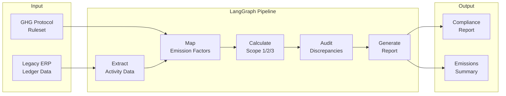

**ESG compliance auditor — map legacy ERP ledgers to GHG Protocol Scope 1/2/3 emissions.**

---

## 🏗️ Pipeline



---

## ✨ Features

- **ERP extraction** — read legacy ledger formats (CSV, Excel, DB)
- **Emission factor mapping** — match activities to GHG Protocol factors
- **Scope 1/2/3 calculation** — comprehensive emissions accounting
- **Discrepancy detection** — flag missing or inconsistent data
- **Compliance reporting** — structured reports with methodology notes

---

## 🚀 Quick Start

```bash
pip install -r requirements.txt
python -m vanguard.audit --ledger emissions_2024.csv --rules ghg_protocol.json
```

---

## 📁 Project Structure

```
Vanguard/
├── vanguard/
│   ├── graph.py           # LangGraph pipeline
│   ├── extract.py         # ERP data extraction
│   ├── mapper.py          # Emission factor mapping
│   ├── calculator.py      # Scope 1/2/3 math
│   ├── audit.py           # Discrepancy detection
│   └── reporter.py        # Compliance report generation
├── tests/
└── README.md
```

---

## 📄 License

MIT © Md Sadman Bin Masud
