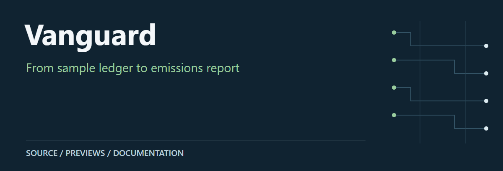
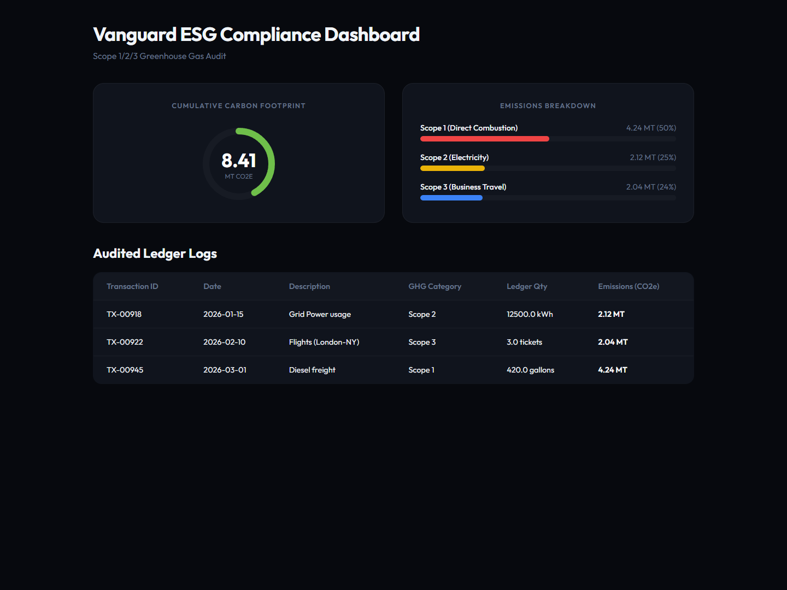
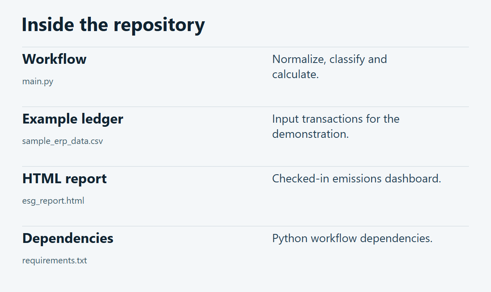

# Vanguard

A LangGraph demonstration that normalizes ledger CSV rows, classifies sample activities and calculates an HTML emissions report using explicit factors in the code.

**[Source guide](#source-guide)** · **[Getting started](#getting-started)** · **[Scope & limitations](#scope--limitations)**

## Preview

[](docs/visuals/preview.png)

Browser rendering of the repository’s sample Scope 1/2/3 report.

## Source guide

[](docs/visuals/repository-guide.png)

| Component | Open source | Purpose |
| :-- | :-- | :-- |
| Workflow | [`main.py`](main.py) | Normalize, classify and calculate. |
| Example ledger | [`sample_erp_data.csv`](sample_erp_data.csv) | Input transactions for the demonstration. |
| HTML report | [`esg_report.html`](esg_report.html) | Checked-in emissions dashboard. |
| Dependencies | [`requirements.txt`](requirements.txt) | Python workflow dependencies. |

## Getting started

From a local checkout of this repository:

```bash
python -m pip install -r requirements.txt
python main.py
```

## Scope & limitations

Emission factors are demonstration constants, not a verified current inventory methodology. The preview shows a checked-in sample report; it is not a certified ESG audit.

---

[Visual asset sources and presentation notes](docs/visuals/README.md)
