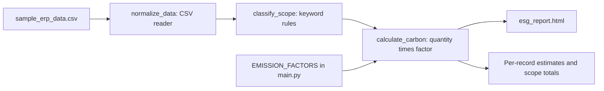

# Vanguard

**From a sample ERP ledger to a readable emissions dashboard.**

Vanguard is a small LangGraph demonstration of CSV ingestion, rule-based Scope 1/2/3 classification, and illustrative carbon calculations. It turns the included ledger into an HTML report with per-record estimates and scope totals—an inspectable starting point for reporting workflows, not a certified compliance engine.

[Quickstart](#quickstart) · [Workflow](#workflow) · [Input and configuration](#input-and-configuration) · [Limitations](#limitations)

## Workflow



This follows the graph constructed in the `__main__` block of [main.py](main.py). Its calculator/exporter is `carbon_calculator_exporter_node`.

## Quickstart

Use Python 3.10+ as the project's documented baseline, with Git and pip available.

```bash
git clone https://github.com/MdSadman20040812/Vanguard.git
cd Vanguard
pip install -r requirements.txt
python main.py
```

The program reads `sample_erp_data.csv` beside the script and writes `esg_report.html` in the same directory, replacing any existing report. Open that file in a browser after the run completes. A [committed sample dashboard](esg_report.html) is available to download and inspect before running anything.

The current pipeline does not call an LLM or require an API key. It uses Python's `csv` module rather than Pandas.

## Input and configuration

The supplied CSV uses these columns:

```csv
TRANSACTION_ID,DATE,ACCOUNT,DESCRIPTION,AMOUNT,QTY
```

`DESCRIPTION` and `QTY` drive the estimate. The quantity parser expects a numeric token followed by an optional space-separated unit, such as `12500 kWh`. `AMOUNT` and `ACCOUNT` are not used to calculate emissions.

| Rule in `main.py` | Assigned category |
| --- | --- |
| Description contains `diesel` or `fuel` | Scope 1, diesel factor |
| Description contains `grid`, `electricity`, or `power` | Scope 2, electricity factor |
| Everything else | Scope 3, flights factor |

The `EMISSION_FACTORS` dictionary supplies the coefficients. Review their units, geography, reporting period, and provenance before using this pattern with real data. The source does not convert units or validate them against the selected factor.

## Source map

| File | Purpose |
| --- | --- |
| [main.py](main.py) | State, keyword classifier, factors, HTML template, and executable graph |
| [sample_erp_data.csv](sample_erp_data.csv) | Default ledger fixture |
| [esg_report.html](esg_report.html) | Committed report example; overwritten by a run |
| [requirements.txt](requirements.txt) | Declared Python dependencies |

## Limitations

- Estimates are illustrative. This repository does not establish conformity with a greenhouse-gas accounting standard or regulatory submission requirements.
- The fallback classification treats every unrecognized description as a flight. Real workflows need an explicit unknown/review category and broader coverage.
- Factors are hard-coded without source/version metadata, and dates and currency are read rather than normalized. There is no PDF export or CSV audit-trail exporter in the current source.
- The reusable `build_esg_compliance_workflow()` helper references an undefined `carbon_calculator_node`. The documented `python main.py` path constructs its graph separately with the defined exporter.
- Ledger text is inserted into HTML without escaping. Use trusted fixtures; escape untrusted values before exposing the report as a service. The report loads fonts from Google Fonts.
- Dependencies are not locked, and this documentation refresh did not execute the application. No license file is present in the inspected repository tree.

## Contribute

Open an issue or pull request with a small anonymized ledger and expected classification. Useful improvements include sourced factor catalogs, unit validation, an unknown-category review path, HTML escaping, and tests that align the graph-builder helper with the executable entry point.
