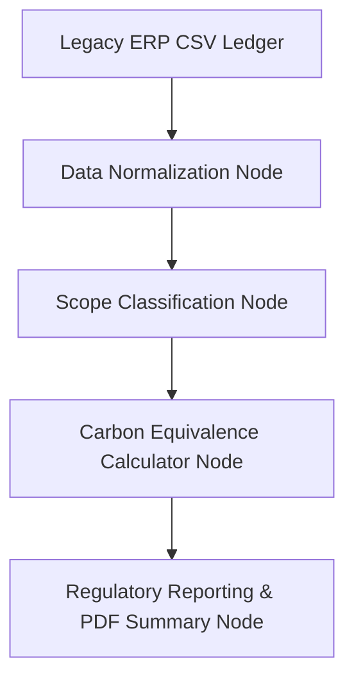

# Vanguard Compliance Engine 📊 — Legacy ESG Data Auditor

Vanguard is an automated ESG audit pipeline that ingests raw, unstructured accounting logs or utility ledgers from legacy enterprise ERP systems. Built with **LangGraph**, it identifies purchase records, extracts utility units, maps items to Scope 1/2/3 greenhouse gas classifications, and generates compliance dashboards.

## System Workflows



1.  **Data Normalization Node**: Sanitizes date formats, currency columns, and extracts units (e.g. kWh, gallons, tickets).
2.  **Scope Classification Node**: Categorizes items into Greenhouse Gas Protocol zones:
    *   **Scope 1**: Direct emissions (e.g. diesel freight fuel).
    *   **Scope 2**: Indirect electricity emissions (e.g. grid utility power).
    *   **Scope 3**: Indirect value chain/travel emissions (e.g. business flights).
3.  **Carbon Equivalence Calculator**: Applies international conversion emission factors to convert units into metric tons of CO2e.
4.  **Reporting Node**: Aggregates totals for corporate compliance audits.

## Getting Started

### 1. Installation
Install dependencies:
```bash
pip install -r requirements.txt
```

### 2. Run Pipeline
Execute the pipeline against sample ERP ledger logs:
```bash
python main.py
```
This processes the local CSV records, runs the carbon classifier nodes, and prints the audit report showing total Scope 1/2/3 emission metrics.
